# Awesome-Browser-Based-Command-Line-Interface 💻 🌐

  

  
  
  
  
  
  

---

## 🌟 Top Browser-Based Command Line Interface & Cloud Shell Ecosystem 🚀

**Curated List of Commercial Cloud Shells, Cloud IDEs & Open-Source Web Terminal Frameworks**  
*Focused on Browser-Based Terminals, Cloud Development Environments (CDE), Self-Hosted Shell Gateways, xterm.js Emulators & Containerized Workspace Streaming* ⚡

**Last updated: October 2026** 📅

---

### 📌 Overview & SEO Summary 🔍
Welcome to the ultimate curated directory of **browser-based command line interfaces**, **cloud shells**, **cloud development environments (CDE)**, and **open-source web terminal engines**. Whether you are evaluating enterprise cloud shell platforms (such as *Microsoft Azure Cloud Shell*, *GitHub Codespaces*, *AWS CloudShell*, and *Google Cloud Shell*), developer environments (*Replit*, *StackBlitz*, *Daytona*), or self-hosted open-source web terminals (*xterm.js*, *ttyd*, *Gotty*, *wetty*, *Kasm Workspaces*, *termview*), this guide covers features, pricing, free tier limits, company market cap/valuation, and star counts for open-source repositories.

---

## 📑 Table of Contents 📜
- [📈 Market Size & Industry Structure](#-market-size--industry-structure)
- [🏢 SaaS & Commercial Platforms](#-saas--commercial-platforms)
- [🔓 Open-Source GitHub Projects](#-open-source-github-projects)
- [🛠️ How to Contribute](#%EF%B8%8F-how-to-contribute)
- [📊 Star History](#-star-history)
- [🤝 Support & Sponsorship](#-support--sponsorship)
- [⚠️ Disclaimer](#%EF%B8%8F-disclaimer)

---

## 📈 Market Size & Industry Structure 📊

> [!NOTE]
> **Market Insights (2026):** The global Cloud Development Environment (CDE) and Browser-Based Terminal market is estimated at **$4.8 Billion USD** (growing at a 22.4% CAGR). The market structure is **moderately fragmented** with hyperscalers (Microsoft, AWS, Google) dominating built-in infrastructure cloud shells, while agile startups and specialized providers (StackBlitz, Replit, Daytona, Kasm) capture niche markets in instant web prototyping, container streaming, and localized browser execution.

---

## 🏢 SaaS / Commercial Platforms 💼

The browser-based CLI and cloud environment market offers both free provider cloud shells and paid subscription cloud environments. Below is a comprehensive, sorted list of SaaS platforms ordered by company **valuation / market cap (descending)** 💰:

| SaaS / Commercial Platform | Company / Owner | Valuation / Market Cap 💰 | Pricing (Starting Tier) 🏷️ | Free Tier / Free Trial Limits 🎁 | Description 📝 |
| :--- | :--- | :--- | :--- | :--- | :--- |
| **[Azure Cloud Shell](https://azure.microsoft.com/en-us/products/cloud-shell/)** 🔷 | Microsoft | **~$3.90 Trillion** | **$0.024/GB-month** (for required Azure File Storage share) | **Free service**: 5 GB persistent storage, 20 concurrent sessions per tenant | **Azure terminal (Bash or PowerShell)** — Ubuntu-based browser terminal. Pre-installed with Azure CLI, PowerShell, Terraform, Docker, and Git. |
| **[GitHub Codespaces](https://github.com/features/codespaces)** 🐙 | Microsoft / GitHub | **~$3.90 Trillion** | **$0.18/core-hour** (2-core compute) + $0.07/GB-month storage | **Free forever**: 120 core-hours/month + 15 GB storage for personal accounts | **Full VS Code editor & PTY terminal in browser** — Dev Container support, terminal access, port forwarding, and pre-built extensions. |
| **[AWS CloudShell](https://aws.amazon.com/cloudshell/)** ☁️ | Amazon | **~$2.0 Trillion** | **$0.00** (Free service; pay only for underlying AWS infrastructure created) | **Free forever**: 1 GB persistent storage per region, 10 concurrent sessions | **Browser Linux terminal in AWS Console** — Pre-authenticated with console credentials. Includes AWS CLI v2, zsh, vim, Git, npm, pip. |
| **[Google Cloud Shell](https://cloud.google.com/shell)** 🌐 | Google (Alphabet) | **~$2.0 Trillion** | **$0.00** (Free service; pay only for GCP cloud resources provisioned) | **Free forever**: 5 GB persistent storage, 60 compute hours per week | **GCP terminal with built-in IDE** — Debian-based terminal equipped with gcloud, kubectl, Terraform, Docker, and built-in code editor. |
| **[Replit](https://replit.com/)** 🎮 | Replit Inc. | **~$1.16 Billion** | **$20.00/month** (Core plan, billed annually at $204/yr) | **Starter Free Tier**: Free workspace, daily AI Agent allowance, 1 published app | **Browser-based IDE & terminal with AI Agent** — Instant coding environment for Python, Node.js, and web apps with interactive terminal. |
| **[StackBlitz](https://stackblitz.com/)** ⚡ | StackBlitz | **~$200 Million** | **$8.33/month** (Pro plan billed annually at $100/yr) | **Free for public repositories**: Unlimited public sandboxes, WebContainers engine | **Web-native dev environment** — Runs Node.js and shell commands natively inside the browser via WebContainers technology. |
| **[Gitpod (Ona)](https://ona.com/)** 🦊 | Ona (formerly Gitpod) | **~$120 Million** | **$15.00/user/month** (Flex tier) | **14-day free trial**: 50 credits/month for cloud dev environment testing | **Automated cloud development environments** — Ephemeral, pre-configured environments with browser terminal and VS Code frontend. |
| **[Codeanywhere](https://codeanywhere.com/)** 📦 | Codeanywhere | **~$50 Million** | **$6.00/user/month** (Basic plan) | **7-day free trial**: 1 container, 2 vCPU, 4 GB RAM, 10 GB disk | **Cloud-based IDE & SSH web terminal** | Connects to FTP, GitHub, Bitbucket, and custom SSH servers directly from browser tabs. |
| **[Daytona](https://www.daytona.io/)** 🏎️ | Daytona | **~$30 Million** | **$0.0504/vCPU-hour** ($0.0162/GiB-hour usage billing) | **$200 free compute credits** on initial signup | **Usage-based open CDE infrastructure** — Sub-90ms cold starts with PTY terminal streaming and custom devcontainer support. |
| **[Kasm Workspaces](https://kasm.com/)** 🐳 | Kasm Technologies | **~$25 Million** | **$10.00/user/month** (Professional tier) | **Community Edition Free**: 5 concurrent streaming sessions, unlimited users | **Containerized workspace streaming platform** — Streams Linux desktops, terminal containers, and web isolation workloads to browsers. |

---

## 🔓 Open-Source GitHub Projects 🌐

*Sorted by GitHub Star Count (Descending)* 🌟

- **[xterm.js](https://github.com/xtermjs/xterm.js)**   
  **The standard front-end terminal component for the web** written in TypeScript. Powers VS Code, Windows Terminal, Hyper, and hundreds of web terminals. Supports WebGL rendering, canvas fallback, ANSI colors, and PTY bindings. ⚡ 💻

- **[ttyd](https://github.com/tsl0922/ttyd)**   
  **Simple command-line tool for sharing terminal over the web** written in C using `libwebsockets` and `xterm.js`. Lightweight, fast, supports SSL/TLS, custom authentication, and cross-platform execution on Linux, macOS, OpenWrt, and BSD. 🚀 🛡️

- **[Gotty](https://github.com/yudai/gotty)**   
  **Go-based CLI tool that shares your terminal applications as a web application**. Turns PTY programs (zsh, tmux, top, vim) into instant HTTP server sessions accessible via any web browser. 🔧 🌐

- **[wetty](https://github.com/butterhen/wetty)**   
  **Terminal over HTTP and HTTPS** powered by Node.js, Express, Socket.io, and xterm.js. Connects web clients directly to local SSH servers or system PTY shells with system authentication. 🔒 📦

- **[Kasm Workspaces Images](https://github.com/kasmtech/workspaces-images)**   
  **Open-source Docker workspace streaming images** for Linux desktops, web terminals, and isolated web tools. Streams Docker container environments over WebRTC/KasmVNC with audio and clipboard support. 🐳 🖥️

- **[termview](https://github.com/javy99/termview)**   
  **Share any terminal in the browser**, MIT licensed. Go + PTY + WebSockets + xterm.js. Run anything that works in a terminal: Bash, Python, Go, REPLs, scripts. Single command startup: `./termview bash`. 🔧 📡

- **[tailmux](https://github.com/adamcowan/tailmux)**   
  **Browser-based terminal with tmux integration**, open-source. Multi-tab support, mobile virtual keyboard, persistent tmux session re-attaching, optimized for private network tailscale access. 🛡️ 🎛️

- **[web-terminal-engine](https://github.com/cplieger/web-terminal-engine)**   
  **Go-based web terminal engine**, open-source. Server-side session state management, status derivation from OSC progress reports, synchronized tab order across browser clients. 🎛️ ⚙️

- **[Terminal-HTML](https://github.com/builtbyashwin/Terminal)**   
  **Minimal client-side Linux terminal emulator**, GPL-3.0 licensed. Pure HTML/CSS/JS without backend server requirements. Features simulated file tree (`ls`, `cd`, `mkdir`, `pwd`, `rmdir`). 🔰 💻

- **[tunnelterm](https://github.com/tunnelterm/tunnelterm)**   
  **Secure browser terminal over HTTP/WebSocket**, open-source. Password authentication (`TUNNELTERM_PASSWORD`), optional 2FA/TOTP token verification, session idle timeouts, and CWE-532 log compliance. 🔒 🛡️

- **[ptylon](https://github.com/ptylon/ptylon)**   
  **Self-hosted browser-native terminal workspace**, MIT licensed. Persistent terminals, server-rendered browser tabs, split panes, Monaco code editor, and built-in theme gallery. 🚀 🎨

---

## 🛠️ How to Contribute 🤝

Contributions are welcome! Follow these steps to submit new browser-based CLI platforms or open-source web terminal software:

1. 🍴 **Fork** the repository.
2. 📝 **Add/edit** entries in `README.md` maintaining table/list structure and formatting.
3. 🔗 Include project title, official website/GitHub link, exact star count, license, and brief description.
4. 🚀 Submit a **Pull Request** with a descriptive summary of your changes.

---

## 📊 Star History

---

## 🤝 Support & Sponsorship 💖

Thank you for visiting and supporting the **Awesome Browser-Based Command Line Interface** directory! If you find this curated resource helpful for your work, projects, or research, please consider supporting us:

- ⭐ **Star** this repository on GitHub to increase visibility!
- 🔀 **Fork** and share this repo with fellow developers, DevOps engineers, and cloud architects.
- ☕ **Sponsor & Buy Me a Coffee**: Support ongoing open-source curation and maintenance via the [GitHub Sponsor Dashboard](https://github.com/sponsors/ishandutta2007).

---

## ⚠️ Disclaimer ℹ️

- This is a **community-curated** directory for educational and research purposes — not exhaustive and not an explicit commercial endorsement. ℹ️
- **Gitpod Classic pay-as-you-go sunset on October 15, 2025** — existing users should plan migration to Ona or alternative platforms.
- Browser-based shells execute real commands with your credentials. **Review authentication, network isolation, and session timeout settings** before deploying. Tailmux explicitly warns that it has **no authentication by default** unless `TAILMUX_TOKEN` is set. Azure Cloud Shell has a **20 concurrent session limit per tenant** and times out after 20 minutes idle. AWS CloudShell provides **10 concurrent sessions per region** and 1 GB persistent storage. 🔒
- Open-source solutions (ttyd, Gotty, wetty, Kasm Workspaces) provide self-hosted ownership and transparency, but enterprise-grade SLA guarantees, 24/7 support, and managed infrastructure remain primarily commercial offerings. 🌐

---

  <b>Made with ❤️ for developers, DevOps engineers, and open-source cloud workspace advocates.</b>

